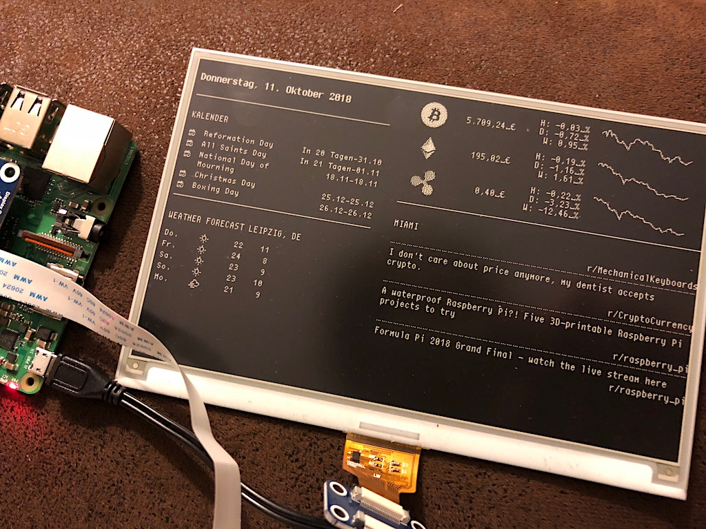

<p align="center">
  <a href="/LICENSE">
    
  </a>
  
</p>
<p align="center">

</p>

## How it works
The node.js script uses [puppeteer (Headless Chrome Node API)](https://github.com/GoogleChrome/puppeteer),
to take a screenshot of the local running MagicMirror site (localhost:808) and saves it.  
*You can change the size of the screenshot and the MagicMirror port in the
 [config.js](https://github.com/BenRoe/rpi-magicmirror-eink/blob/master/config.js) file.*  

Then the script executes a the eInk Python script from the
 [ePaperPython folder](https://github.com/BenRoe/rpi-magicmirror-eink/tree/master/ePaperPython)
 and updates the eInk screen.  
This is the original Python script from [Waveshare](https://www.waveshare.com/wiki/7.5inch_e-Paper_HAT).


## Requirements
- Raspberry Pi with Raspbian
- [Waveshare 7.5 epaper display](http://s.click.aliexpress.com/e/cs4zJho4) <small>(affiliate link)</small>
- running [MagicMirror](https://github.com/MichMich/MagicMirror#server-only) (serveronly)

## Resources
- [3d printable frame](https://www.thingiverse.com/thing:3382910)
- [Installations-Tutorial (deutsch)](https://maker-tutorials.com/7-5-eink-epaper-bilderrahmen-magicmirror-display-raspberry-pi-zero-w/)
- [MagicMirror Module List](https://github.com/MichMich/MagicMirror/wiki/3rd-Party-Modules)

## Install dependencies

- Update packages and install Git, Chrome Browser
```shell
sudo apt-get update && sudo apt-get install -y git chromium-browser
```
- Install Node.js and npm
```shell
curl -sL https://deb.nodesource.com/setup_11.x | sudo -E bash -
sudo apt-get install -y nodejs
```
- Install PM2 (process manager for Node.js)
```shell
sudo npm install -g pm2
// Starting PM2 on Boot
pm2 startup
// pm2 start node serveronly
// pm2 save
```

## Setup
- Clone/copy the project files to your system.
```shell
git clone https://github.com/BenRoe/rpi-magicmirror-eink.git
```

- Move to the project folder
```shell
cd rpi-magicmirror-eink
```

- Install Node.js dependencies (inside the `rpi-magicmirror-eink` folder)
```shell
npm install
```

- Copy all files & folder from `magicmirror-files/css` to your MagicMirror css folder.
```shell
cp -a magicmirror-files/css/. ~/MagicMirror/css
```

- Copy the prepared MagicMirror config.js to MagicMirror config folder.
```shell
cp magicmirror-files/config.js ~/MagicMirror/config/
```

- Start the script with PM2 and run it in the background
```shell
pm2 start index.js --name "eink-update"
pm2 save
```

## Todo
- [X] 3d print case
- [ ] support more waveshare epaper display sizes
- [ ] white background/black font mode (invert image with [jimp](https://github.com/oliver-moran/jimp) (image.invert();))

## Ressources
- [Cherry bitmap font](https://github.com/turquoise-hexagon/cherry) by [marin](https://github.com/turquoise-hexagon) converted to ttf with [Bits'N'Picas](https://github.com/kreativekorp/bitsnpicas)
- The project uses the Original Library written by Waveshare. It can be downloaded [here](https://www.waveshare.com/wiki/Main_Page#OLEDs_.2F_LCDs).

